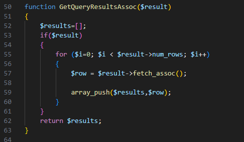
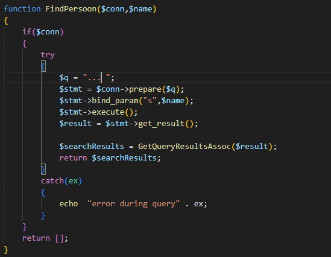

## Tijd voor insert

laten we eerst de insert in de database even oefenen:

- maak een nieuwe file:
    - `02 insert naw.sql`
    - sla deze op in je `sql` directory
- zet daar het volgende in:
    >  

## testen

- test je script en kijk of alles lukt:
    >  
- check nu de data in je table met deze select:
    >  
    - resultaat:
    >  

## Formulier

- maak een nieuwe file:
    - `searchNaw.html`
- maak daar de standaard html opzet in
    > TIP: gebruik `!`
- maak een formulier aan:
    - met `1 text input veld`
        - met name `searchPersoon`
    - maak een `submit button`
- de method moet `GET` zijn
- de `action` moet naar `searchNaw.php` gaan
- het formulier moet een `id` hebben:
    - `searchForm`

## Naar php

Nu gaan we dit in php ook doen.
- maak een nieuwe file:
    - `searchNaw.php`
    - include hier je `database.php` (waar je database connection/gegevens staan)
    >  
> Let even op het pad, zie je de `..` we gaan `relatief` naar waar `database.php` staat want die staat niet in dezelfde directory

- neem nu de code hieronder over in `searchNaw.php`
    >  

> dit is een helper function waarmee je iets wat je anders elke keer zou moeten schrijven nu op 1 plek maakt

## FindPersoon

- nu gaan we onze function maken om personen mee te zoeken:
    - neem deze code over :
    >  

> Wat doet deze function?
> - de function heeft 2 argumenten:
>  - $conn, het mysqli connectie object
>  - $name, de zoekopdracht 
> - als de `function` fout gaat geeft het een lege lijst terug, dat is `SOMS` netjes
> - de `function` voert de query `q` uit op via het `prepared statement` patroon (hack veilig)
> - dan roept het de helper function `GetResults` aan die de `$result` in rijen met data verandered

- Maak de function werkend:
    - schrijf de query om * te selecteren uit `naw`
    - gebruik een `where` om te filteren op `naam`
        - LET OP: je zet voor de waarde niet `$name` daarin maar `?` vanwege de prepared statement

## $_GET

- maak een nieuwe variable:
    - `$searchInput`
        - zet dit boven in je file
            - (niet in een function!)
    - geef deze de waarde die vanuit je formulier verstuurd wordt
        - dus uit je `querystring`, gebruik `$_GET`
        - bekijk je `html` hoe had je de `name` van je input text genoemd?
            - die waarde moet je gebruiken!

## testen

- nu nog testen, gebruik deze code
    > `LET OP`, misschien heten jullie `$user`,`$pass, etc anders, check je `database.php`
    > - zet dit onder je `$searchInput`
    >     - (niet in een function!)
    >  

#### UITLEG
- lees:
    > - zie je dat we eerst de connection maken?
    > - daarna geven we de connection door
    > - dan maken we een variabel `$searchResults` en halen de resultaten op met `FindPersoon` en die komen dan in `$searchResults`
    > - `echo json_encode`, maakt van de `$searchResults` een `JSON` text die je kan tonen

- test en controlleer of je dit krijgt:
    >  
- zoek nu ook `leraar`
    - maak een screenshot:
        - sla die op in `screenshots` als `leraargevonden.png`

## meer data

- maak een nieuwe file:
    - `03 insert naw.sql`
    - sla deze op in je `sql` directory
- zet daar 3 nieuwe personen in (verzin ze zelf)
    - gebruik geen echte data!
    
## testen

- zoek nu ook alle 3 je personen uit de `meer data` stap
    - maak een screenshot voor elke zoekactie
        - sla die op in `screenshots` als `meerpersonen.png`

## JSON, MIME en headers

- je json ziet er nog niet zo uit:
    >  

> dat komt omdat we onze header nog niet goed hebben gezet
> - de response komt terug als type text/html:
>   
 
- maak van je code zodat het er zo uitziet: 
>   

> - zie je die header daar? we zeggen nu dat de response nu `application/json` is
>   

## Testen

- zoek nog een keer

> #### ERROR HINTS
> het kan zijn dat je nu dit krijgt:
>   
> ##### Oplossing:
> - zoek in je `search.php` andere naar `echo` regels dan die van de `json_encode`
>    - haal die weg met commentaar `//`

- zoek nog een keer krijg je nu dit:
    >  
- zoek je eigen verzonnen persoon
    - maak een screenshot en sla op in `mooiejson.png`

## Klaar?
- commit naar je github
