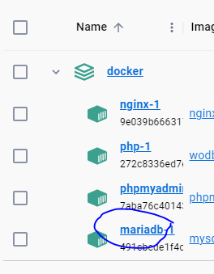
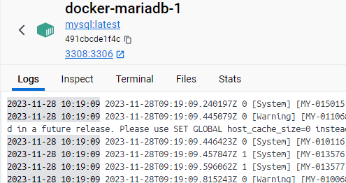
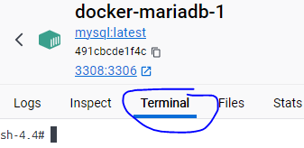
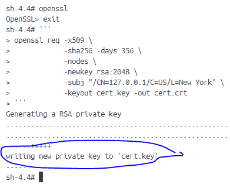
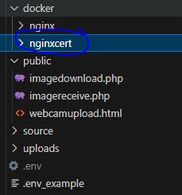
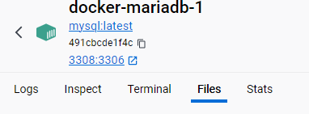

## Webcam api UITLEG

- lees ( DIT IS BELANGRIJK goed lezen!)
    > De webcam api heeft een aantal punten waar je rekening mee moet houden:
    > - de api is nog experimenteel 
    > - de api werkt in `edge` + `chrome` volledig
    >     - gebruik deze browsers om te testen!
    > - de api kan alleen vanaf een `HTTPS` verbinding gebruikt worden
    >     - dus je test vanaf je `MA_CLOUD`
    >     - OF je zoekt uit hoe je https in docker aan de praat krijgt!
    >         - zie mapje `nginxcert` voor wat `developer` certificaten


## certificaten genereren

- start je docker container op:
    
> </br>

- click nu op `mariadb-1`:
> </br>

- je ziet nu `mariadb-1`:
> </br>
- click op `terminal`:
> </br>

- type `openssl`:
    - en daarna exit
    > </br>

> - nu gaan we een certificaat genereren:
> `BELANGRIJK`: Deze certificaten zijn `ALLEEN` voor je developer docker, `NOOIT` voor een `echte server` die `vanaf het internet` te benaderen is

- kopieer het volgende:
```
openssl req -x509 \
            -sha256 -days 356 \
            -nodes \
            -newkey rsa:2048 \
            -subj "/CN=127.0.0.1/C=US/L=New York" \
            -keyout cert.key -out cert.crt 
```

- check of het werkt:
> </br>

## certificaten uit je docker halen:

- maak in je project onder `docker` een map aan:
    - met naam `nginxcert`
    > </br>

- ga naar files
> </br>
- check of daar je certificaten staan:
> </br>
- sla met `save` beide certificaten op op je pc
    - sla deze op in `nginxcert`
    > </br>
- dan ziet het er zo uit:
    > </br>
    

#### UITLEG

- lees:
    > Normaal zet je `NOOIT` key certificaten in git, alleen de `public` variant mag
    > in dit geval kan het `MAAR`:
    > - als je dit ergens `LIVE` gaat zetten, `MOET` je andere certificaten maken!
    > Dit komt omdat als iemand je `private key` certificaat heeft die persoon zich kan `voordoen` als jou/ jou server

 ## Klaar?
- commit naar je github
